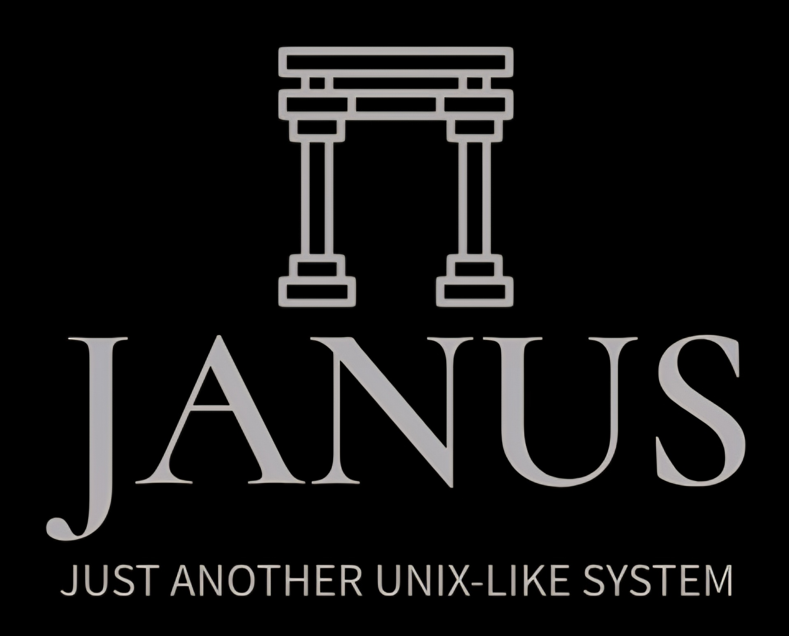

<p align="center"><a href="https://github.com/FrederikTobner/JANUS"></a></p>
<p align="center">A monolitihic kernel, supporting x86_64 and aarch64.</p>

[](https://github.com/FrederikTobner/JANUS/actions/workflows/build.yaml)
[](https://github.com/FrederikTobner/JANUS/actions/workflows/tools.yaml)
[](https://github.com/FrederikTobner/JANUS/actions/workflows/doxygen.yaml)
[](https://github.com/FrederikTobner/JANUS/actions/workflows/tools.yaml)
[](https://en.cppreference.com/w/c/17)

## Quick Start

For building the kernel the usage of one of the presets is recommended to simplify the configuration.

```bash
# Using presets (recommended):
cmake --preset x86_64-gcc        # or x86_64-clang, aarch64-gcc, aarch64-clang
cmake --build --preset x86_64-gcc
```

Since both clang and gcc are supported under all architectures the available presets are `x86_64-gcc`, `x86_64-clang`, `aarch64-gcc` and `aarch64-clang`.

For creating all bootable ISO's for the current architecture with the supported boot protocols, you can execute the following command:

```bash
ninja -C build-x86_64-gcc iso         # or: cmake --build --preset <preset> --target iso
```

For running the kernel in QEMU every supported boot protocol defines its own target, that can be used to make the setup easier:

```bash
ninja -C build-x86_64-gcc run-<protocol>         # E.g ninja -C build-x86_64-gcc run-limine
```

Currently JANUS supports the following boot protocols per architecture:

| Architecture | Supported Boot Protocols |
|--------------|--------------------------|
| x86_64       | limine, multiboot2       |
| aarch64      | limine                   |

## License

This project is licensed under the [GNU AFFERO GENERAL PUBLIC LICENSE](LICENSE)
