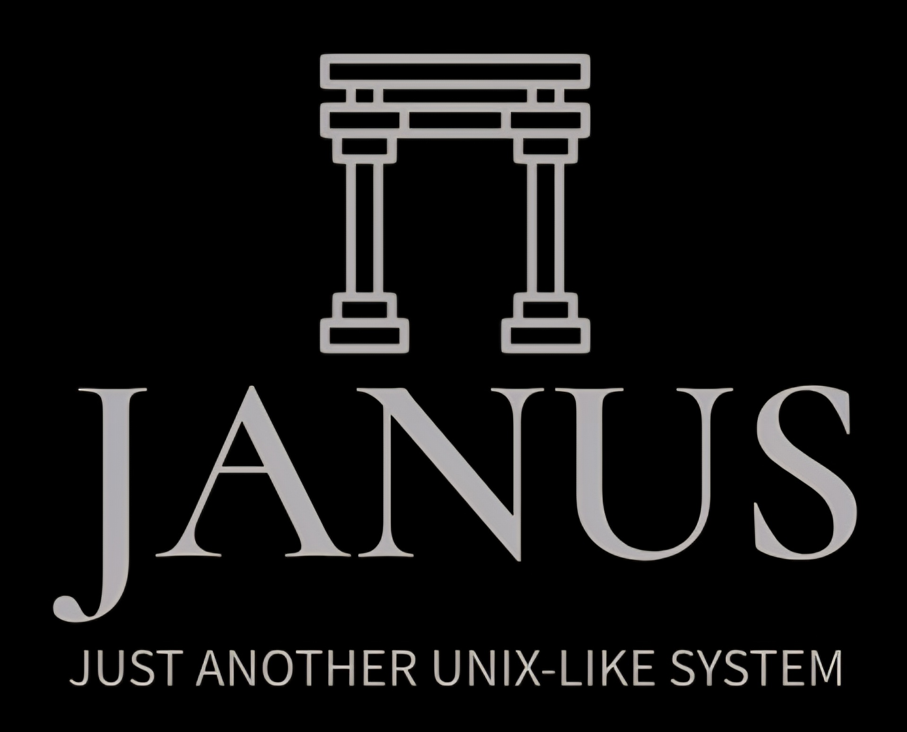

<p align="center"><a href="https://github.com/FrederikTobner/JANUS"></a></p>
<p align="center">A monolithic kernel, supporting x86_64 and aarch64.</p>

[](https://github.com/FrederikTobner/JANUS/actions/workflows/build.yaml)
[](https://github.com/FrederikTobner/JANUS/actions/workflows/tools.yaml)
[](https://github.com/FrederikTobner/JANUS/actions/workflows/doxygen.yaml)
[](https://github.com/FrederikTobner/JANUS/actions/workflows/smoke.yaml)
[](https://codecov.io/gh/FrederikTobner/JANUS)
[](https://en.cppreference.com/w/c/17)

## Quick Start

For building the kernel the usage of one of the presets is recommended to simplify the configuration.

```bash
# Using presets (recommended):
cmake --preset x86_64-gcc        # or x86_64-clang, aarch64-gcc, aarch64-clang
cmake --build --preset x86_64-gcc
```

Currently the following presets are defined:

| Architecture | Compiler | Preset name  |
|--------------|----------|--------------|
| x86_64       | clang    | x86_64-clang |
| x86_64       | gcc      | x86_64-gcc   |
| aarch64      | clang    | aarch64-clang |
| aarch64      | gcc      | aarch64-gcc   |

For creating all bootable ISO's for the current architecture with the supported boot protocols, the following command can be used:

```bash
ninja -C build-<preset> iso         
```

For running the kernel in QEMU every supported boot protocol defines its own target:

```bash
ninja -C build-<preset> run-<protocol>         # E.g ninja -C build-x86_64-gcc run-limine
```

JANUS supports the following boot protocols (per cpu architecture):

| Architecture | Supported Boot Protocols |
|--------------|--------------------------|
| x86_64       | limine, multiboot2       |
| aarch64      | limine                   |

A more detailed setup guide can be found in the [documentation](./docs/01-getting-started.md)

## License

This project is licensed under the [GNU AFFERO GENERAL PUBLIC LICENSE](LICENSE)
