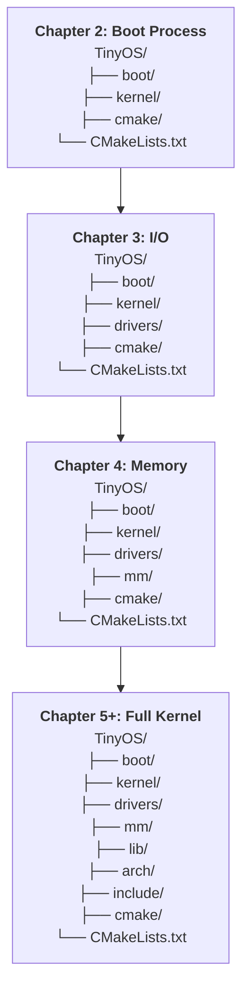

# Project Setup

Now that your tools are installed and verified, let's create the project structure.

[!side]
We build incrementally. Each chapter adds structure as we need it, not all upfront.
[/!side]

## Creating the Project Directory

```bash
mkdir -p TinyOS
cd TinyOS

# Initialize git repository
git init
```

## Initial Directory Structure

We'll build the project incrementally throughout the book. For now, just create the top-level directory. Each chapter adds new components as we need them.

### Project Evolution Roadmap



**Chapter-by-chapter additions:**

- **Chapter 2**: Boot code, build system, Multiboot header
- **Chapter 3**: I/O drivers (serial, VGA, keyboard)
- **Chapter 4**: Memory management (physical and virtual)
- **Chapter 5**: Kernel features (interrupts, system calls)

Don't create subdirectories yet—we'll build them piece by piece as we understand what we're building.

[!side]
Premature structure leads to `misc/`, `utils/`, and `stuff/` directories. We avoid that by building only what we need.
[/!side]

## Scope: What This Book Focuses On

This book teaches OS development, not prerequisite tools. We assume you're already comfortable with:

- **Your editor**: Use whatever you prefer. The project includes `.clangd` for LSP-compatible editors (autocomplete, go-to-definition, error highlighting) if you want it.

[!side]
Vim, Emacs, VS Code, CLion—whatever makes you productive. The code is the same regardless.
[/!side]

- **Git workflows**: We use version control but don't teach it.
- **Shell navigation**: Basic command-line skills (cd, ls, running commands).
- **C fundamentals**: Pointers, structs, memory management.
- **Build systems**: We use CMake extensively but focus on *what* we're building, not CMake syntax itself.

If any of these feel unfamiliar, get comfortable with them first. The OS development is challenging enough without fighting your tools.

## Cross-Compilation Flags

Throughout this book, we'll use these compiler flags for cross-compilation:

- `-target x86_64-elf` - Clang's built-in cross-compile to bare metal x86_64
- `-ffreestanding` - No hosted environment (no OS)
- `-nostdlib` - No standard library linking
- `-mno-red-zone` - Disable red zone (x86_64 ABI quirk for kernel code)
- `-fno-stack-protector` - No stack canaries (we're the OS!)

[!side]
Red zone is a 128-byte area below the stack pointer that functions can use without adjusting `rsp`. Interrupts break this assumption in kernel code.
[/!side]

Don't worry about memorizing these. We'll explain each flag when we use it.

---

**Next: [Chapter 2: The Boot Process](../chapter-03-boot-process/README.md)**
