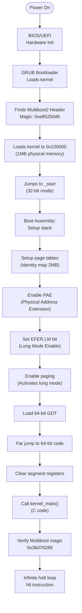

# Chapter 3: The Boot Process

> *"In the beginning there was nothing. And God said 'Let there be light'. And there was still nothing, but now you could see it."*  
> — Terry Pratched

We have our tools installed. Time to write some code that talks directly to hardware. No operating system beneath us. No safety net. Just us, some assembly, and blind faith that GRUB will cooperate.

[!side]
This chapter is where OS development gets real. Every instruction you write executes directly on the CPU.
[/!side]

In this chapter, we'll:

- Set up the TinyOS project structure
- Write a Multiboot2-compliant bootloader header
- Create the boot entry assembly code
- Define memory layout with a linker script
- Automate building with CMake and Ninja
- Implement the kernel entry point in C

By the end of this chapter, we'll have a bootable kernel that verifies it was loaded correctly and halts gracefully.

## Boot Sequence Overview

**Note:** This kernel won't produce any visible output yet—that comes in the next chapter when we add serial I/O. For now, we're building the foundation that everything else depends on.

[!side]
A working kernel that produces no output is like a tree falling in the forest. But Chapter 3 fixes this!
[/!side]

> **Design Note: Why x86_64?**
>
> This book focuses exclusively on the x86_64 architecture (64-bit Intel/AMD processors). Why not ARM, RISC-V, or a portable abstraction layer?
>
> **Learning comes from specifics, not abstractions.** Understanding how x86_64 does paging, interrupts, and system calls teaches you OS fundamentals. Once you deeply understand ONE architecture, porting to others becomes straightforward—you'll know what needs to change and why.
>
> Adding architecture abstraction now would:
>
> - Hide hardware details behind generic interfaces
> - Add complexity without educational value
> - Solve problems we don't have yet
>
> Real-world OS projects start concrete: Linux was x86-only for years, MINIX started on x86, xv6 teaches with RISC-V or x86 separately (not abstracted). Build one well first, then generalize.

---

## Sections

1. [Project Structure](project-structure.md)
2. [The Multiboot2 Header](multiboot-header.md)
3. [Boot Entry Assembly 32bit](boot-assembly-32bit.md)
4. [The Linker Script](linker-script.md)
5. [The CMake Build System](build-system.md)
6. [The Kernel Entry Point](kernel-entry.md)
7. [Creating a Bootable ISO](creating-bootable-iso.md)
8. [Booting up](booting-up.md)
9. [Boot info verification](boot-info-verification.md)
10. [Boot Entry Assembly 64bit](boot-assembly-64bit.md)
11. [Summary: What We've Built](./summary.md)
