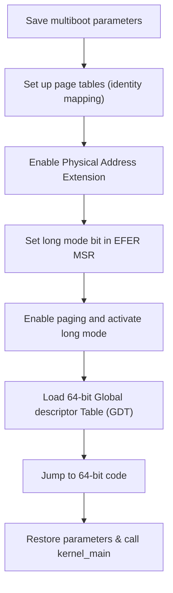
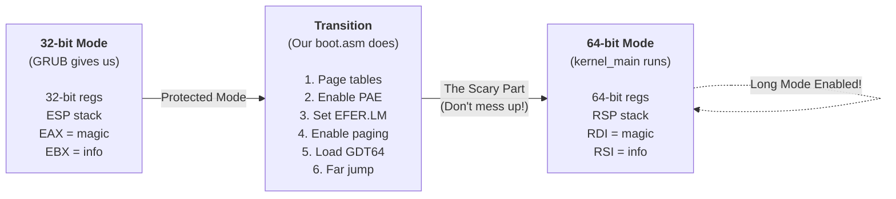

# Understanding the 64-bit Transition

In the previous section, we discovered that GRUB2 already puts us in 32-bit protected mode when loading a 64-bit kernel. Therefor we will need to handle the transition ourself.
Some other bootloaders already handle the transition like Limine. So why are we doing this?

Because understanding the transition teaches you **fundamental OS concepts** you'll need later:

- **CPU operating modes** and their constraints  
- **Page table structure** and virtual memory setup
- **Control registers** (CR0, CR3, CR4) and MSRs
- **The relationship between paging and long mode**
- **GDT structure** and segment selectors

GDT stands for Global Descriptor Table. It is a binary data structure that defines memory segments and their properties.
In is only relevant for to the IA-32 and x86-64 architectures.
The memory segments are descripted by seperate segment descriptors, that are defined in the GDT.
Each entry has a very complex structure, having non-contiguos memory sections for the various properties.
These properties are the base address, the segment limit, access rights, and other flags.
The memory layout of the full descriptor looks like this:

| 0x3F&nbsp;–&nbsp;0x38 | 0x37&nbsp;–&nbsp;0x34 | 0x33&nbsp;–&nbsp;0x30 | 0x2F&nbsp;–&nbsp;0x28 | 0x27&nbsp;–&nbsp;0x10 | 0x0F&nbsp;–&nbsp;0x0 (Limit) |
|:------------------|:------------------|:------------------|:------------------|:------------------|:-------------------------|
| **Base**<br>8 MSB | **Flags**  | **Limit**<br> 4 MSB | **Access Byte** | **Base**<br> 24 LSB | **Limit**<br> 16 LSB      |

These concepts are essential for memory management (Chapter 5), context switching, and system calls.
Additionally if you would like to support Bootloaders that leave you in 32-bit mode like GRUB you need to do this all manually.

## The Complete Boot Sequence

Therfor we will implement what other bootloaders do behind the scenes. The transition requires:



Let's implement each step.

We'll build `kernel/boot/boot.asm` incrementally, adding each piece as we explain it.


Start with the global declarations:

```x86asm-diff
file: kernel/boot/boot.asm
replace: entire file
---
+global _start
+extern kernel_main
+
```

```x86asm-diff
file: kernel/boot/boot.asm
replace: entire file
---
global _start
extern kernel_main
+section .bss
+align 16
+stack_bottom:
+    resb 16384              
+stack_top:
```

We reserve space in the BSS (uninitialized data) section for our stack (16KiB) and page tables.

```x86asm-diff
file: kernel/boot/boot.asm
replace: entire file
---
    resb 16384              
stack_top:
+align 4096
+p4_table:
+    resb 4096
+p3_table:
+    resb 4096
+p2_table:
+    resb 4096
```

 The page tables must be 4096-byte (4KiB) aligned because that's the page size the CPU expects.

Add the entry point where GRUB transfers control to us.
When GRUB loads a 64-bit kernel, it puts us in 32-bit protected mode with paging disabled.
The CPU register `EAX` contains the multiboot magic number (0x36d76289) and `EBX` contains a pointer to the multiboot info structure.
These registers are used under x86 calling conventions to pass the first two function arguments.

But the calling convention for System V AMD64 ABI expects the first two arguments in `RDI` and `RSI`, so we need to transfer the values from `EAX` to `EDI` and from `EBX` to `ESI`.

```x86asm-diff
file: kernel/boot/boot.asm
after: resb 4096
---
 p2_table:
     resb 4096
+
+section .text
+bits 32                     
+
+_start:
+    mov edi, eax            
+    mov esi, ebx           
```

Next we setup the stack pointer `RSP` to point to the top of our stack. Then we call a subroutine to setup the page tables and enable long mode.

Additionally we need to load the global descriptor table and perform a far jump to switch to the 64-bit code segment.

```x86asm-diff
file: kernel/boot/boot.asm
after: resb 4096
---
_start:
    mov edi, eax          
    mov esi, ebx         
+    
+    mov esp, stack_top
+    
+    call setup_page_tables
+    call enable_paging
+    
+    lgdt [gdt64.pointer]
+    
+    jmp gdt64.code:long_mode_start
```

Now add the function that creates our page tables:

```x86asm-diff
file: kernel/boot/boot.asm
after: jmp gdt64.code:long_mode_start
---
     jmp gdt64.code:long_mode_start
+
+setup_page_tables:
+    mov eax, p3_table
+    or eax, 0b11            
+    mov [p4_table], eax
+    
+    mov eax, p2_table
+    or eax, 0b11            
+    mov [p3_table], eax
+    
+    mov eax, 0x0
+    or eax, 0b10000011      
+    mov [p2_table], eax
+    
+    ret
```

We create a simple identity mapping: virtual address 0x0 → physical address 0x0 for the first 2MB. The page entry flags are:

- Bit 0 (Present): Page is present in memory
- Bit 1 (Writable): Page can be written to
- Bit 7 (Huge page): This is a 2MB page, not a 4KB page

The flag value `0b11` equals \\(2^0 + 2^1 = 3\\) (present + writable), and `0b10000011` equals \\(2^0 + 2^1 + 2^7 = 131\\) (present + writable + huge page).

We're using a 2MB **huge page** which skips the P1 (page table) level entirely. This maps the entire first 2MB in one entry instead of 512 individual 4KB pages. A standard 4KB page would require \\(512\\) entries (since \\(2\\text{MB} = 2^{21}\\) bytes and \\(4\\text{KB} = 2^{12}\\) bytes, so \\(2^{21} / 2^{12} = 2^9 = 512\\) pages).

Add this subroutine that transitions the CPU to 64-bit mode:

```x86asm-diff
file: kernel/boot/boot.asm
after: setup_page_tables ret
---
     ret
+
+enable_paging:
+    mov eax, p4_table
+    mov cr3, eax
+    
+    ret
```

This function performs the mode transition sequence.
Fist we load the P4 table address into control register CR3, which tells the CPU where our page tables are located in memory.

Next we enable the Physical Address Extension (PAE) by setting bit 5 in control register CR4. PAE allows the CPU to access more than 4GB of physical memory and is a prerequisite for entering long mode.
```x86asm-diff
file: kernel/boot/boot.asm
after: mov cr3, eax 
---
enable_paging:
    mov eax, p4_table
    mov cr3, eax
    
+    mov eax, cr4
+    or eax, 1 << 5          
+    mov cr4, eax
+
    ret
```

After that we set the Long Mode Enable (LM) bit in the Extended Feature Enable Register (EFER) Model-Specific Register (MSR) using the `rdmsr` and `wrmsr` instructions. This tells the CPU that we want to enter 64-bit mode.


```x86asm-diff
file: kernel/boot/boot.asm
after: mov cr4, eax 
---
    mov eax, cr4
    or eax, 1 << 5          
    mov cr4, eax
    
+    mov ecx, 0xC0000080     
+    rdmsr
+    or eax, 1 << 8          
+    wrmsr
+    
    ret
```

Finally, we enable paging by setting the Paging (PG) bit in control register CR0. Once paging is enabled and long mode is set, the CPU transitions to 64-bit mode.

```x86asm-diff
file: kernel/boot/boot.asm
after: wrmsr 
---
    mov ecx, 0xC0000080     
    rdmsr
    or eax, 1 << 8          
    wrmsr
    
+    mov eax, cr0
+    or eax, 1 << 31          
+    mov cr0, eax
    
    ret
```

> **Aside: Page Table Naming**
>
> The names are confusing because Intel and AMD use different terminology:
>
> - **P4/PML4** = Page Map Level 4 (top level)
> - **P3/PDPT** = Page Directory Pointer Table
> - **P2/PD** = Page Directory
> - **P1/PT** = Page Table (we skip this by using huge pages)
>
> We use the shorter P4/P3/P2 names for simplicity.
We're finally in long mode! Add the 64-bit entry point that calls our kernel:

```x86asm-diff
file: kernel/boot/boot.asm
after: enable_paging ret
---
     ret
+
+bits 64
+long_mode_start:
+    xor ax, ax
+    mov ss, ax
+    mov ds, ax
+    mov es, ax
+    mov fs, ax
+    mov gs, ax
+    
+    call kernel_main
+    
+.hang:
+    cli
+    hlt
+    jmp .hang
```

Now we can actually start writing 64-bit code after we specified the target processor mode using the bits directive.
In long mode, segment registers aren't used for addressing (flat memory model), but we zero them out for cleanliness. The EDI and ESI registers we saved in Step 2 are now RDI and RSI, perfectly positioned as the first two function arguments per the System V AMD64 calling convention. After we call `kernel_main`, we use a 'hlt' instruction in an infinite loop to halt the CPU when the kernel returns.

Finally, add the GDT that defines our 64-bit code segment:

```x86asm-diff
file: boot/boot.asm
after: .hang loop
---
     jmp .hang
+
+section .rodata
+gdt64:
+    dq 0                                    ; Null descriptor
+.code: equ $ - gdt64
+    dq (1<<43) | (1<<44) | (1<<47) | (1<<53) ; Code segment
+.pointer:
+    dw $ - gdt64 - 1                        ; GDT size
+    dq gdt64                                ; GDT address
```

The code segment descriptor sets bits for: executable (bit 43), code/data segment (bit 44), present (bit 47), and 64-bit mode (bit 53). The value \\((1 << 43) | (1 << 44) | (1 << 47) | (1 << 53)\\) creates a 64-bit value with these specific bits set. 




> **TODO: Hand-drawn illustration idea**
> Draw the CPU as a character going through a transformation sequence like a video game power-up. Panel 1: "32-bit CPU" looking small and limited. Panel 2: runnung into a "PAE mushroom" and "EFER star". Panel 3: Powered up"

> **Aside: System V AMD64 ABI**
>
> ABI stands for Application Binary Interface—the rules for how functions are called at the assembly level. It ensures that code that follows the ABI conventions can also be used under different architectures that implement the same ABI.
The System V AMD64 ABI (used by Linux, BSD, and most Unix-like systems) specifies:
>
> - **First 6 integer arguments** go in registers: RDI, RSI, RDX, RCX, R8, R9
> - **Return value** goes in RAX
> - **Stack must be 16-byte aligned** before a call instruction
> - **Certain registers are callee-saved** (RBX, RBP, R12-R15)
>
> So when we call `kernel_main(uint32_t magic, void *info)`, the magic number goes in RDI and the info pointer goes in RSI.


Now lets validate that out boot assembly transition to 64-bit mode works properly.
> TODO: Test registers and show variables

Now rebuild and test:

```bash
ninja -C build
ninja -C build run
```

**Result:** QEMU opens with a blank screen and doesn't crash! The kernel is running. Press Ctrl+C to exit.

We can verify it's working with LLDB (covered in the "Booting Up" chapter).


Our boot assembly now:

- Starts in 32-bit protected mode (as GRUB gives us)
- Sets up identity-mapped page tables for the first 2MB
- Enables PAE, long mode, and paging
- Loads a 64-bit GDT
- Transitions to 64-bit long mode
- Calls our 64-bit kernel successfully

No more triple faults!

---

**Next:** [Summary](./summary.md)
