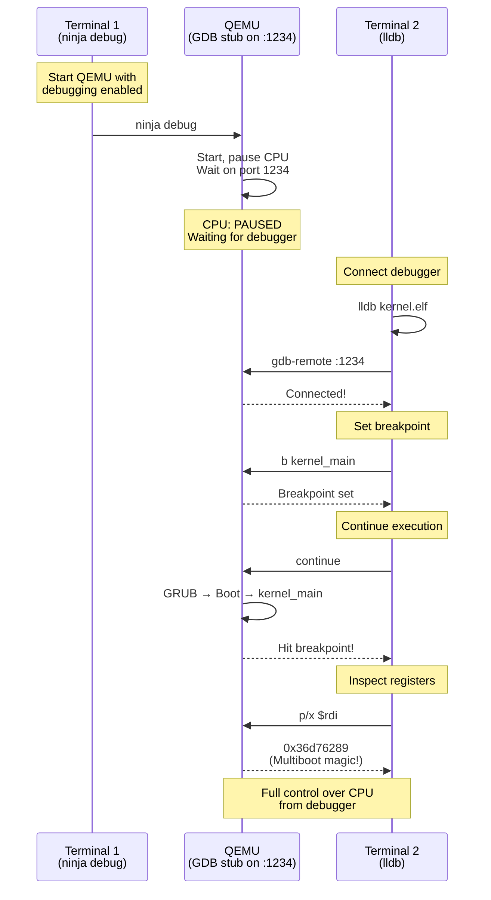

# Booting Up

We have a bootable ISO image containing our kernel and GRUB. Now it's time to actually boot it and prove everything works.

## Testing in QEMU

Time for the moment of truth. Boot the ISO:

```bash
ninja -C build run
```

QEMU should open with... a blank screen. Just black. Nothing.

**Don't panic. This is success.**

[!side]
Every OS developer's first kernel: a beautifully crafted black rectangle. Embrace it!
[/!side]

I know, I know—a black screen doesn't *feel* like success. But think about what's actually happening behind that void:

1. GRUB boots and scans the first 32KB of your kernel
2. Finds the Multiboot2 magic number (0xe85250d6)
3. Validates the checksum
4. Loads your kernel at 1MB (0x100000) in 32-bit protected mode
5. Jumps to `_start` in your boot assembly
6. Your boot assembly sets up page tables and transitions to 64-bit long mode
7. Your assembly sets up a stack and calls `kernel_main()`
8. `kernel_main()` checks the Multiboot magic (0x36d76289)
9. Enters the infinite `hlt` loop

**Your code is running on bare metal.** (Well, virtualized bare metal, but still!)

The black screen is expected. We haven't written any code to output text yet. No VGA driver, no serial console—nothing. The kernel is sitting in that `while(1) __asm__("hlt")` loop exactly as designed, waiting patiently for instructions we haven't given it yet.

Press Ctrl+C to exit QEMU. But how do we know it's actually working?

## Proving the Kernel Works with LLDB

A blank screen doesn't feel like success. Let's use LLDB to prove the kernel is actually running our code.

[!side]
The GDB stub speaks the GDB Remote Serial Protocol. LLDB understands this protocol too.
[/!side]

**What is LLDB?** LLDB is a debugger (like GDB) that lets you pause a running program, inspect memory and registers, and step through code line by line. QEMU has a "GDB stub" that lets debuggers connect to the virtual machine and control the CPU.

> **New to LLDB? Don't panic.**
>
> Yes, it's a command-line debugger. No, you don't need to memorize 47 arcane incantations. If you've used VS Code's debugger or CLion's, you already know the concepts—breakpoints, stepping, inspecting variables. LLDB just does it via text instead of clicking pretty buttons. Think of it as your GUI debugger's grumpy but efficient terminal-dwelling cousin.
>
> Another key difference also comes from using QEMU: we need to debug *remotely* over a network connection to QEMU's virtual CPU.
>
> **Kernel debugging quirks you need to know:**
>
> - **Registers are your best friends now.** Variables? Sure, they exist. But when debugging at this level, you'll spend more time looking at `$rdi` (first function argument) and `$rsi` (second argument) than at named variables. The x86-64 calling convention puts the first 6 arguments in RDI, RSI, RDX, RCX, R8, R9. Your kernel lives in these registers before it lives anywhere else.
> - **No printf debugging.** Seriously. You have no console output yet. Want to check if a value is 0x36d76289? Use `p/x variable` and squint at hex numbers like it's 1975. (We'll fix this eventually with serial output in chapter 4, but for now, embrace the old ways.)
> - **Your call stack is adorably tiny.** Run `bt` and you'll see exactly two frames: `kernel_main` ← `long_mode_start`. That's it. That's your entire kernel so far.
> - **Format specifiers are your friends:** `p/x` for hex (addresses, magic numbers), `p/t` for binary (flags, bitmasks), `p/d` for decimal (counts).
>
> **Essential commands (the cheat sheet):**
>
> | Command | What it does |
> |---------|-------------|
> | `gdb-remote localhost:1234` | Connect to QEMU's debugger |
> | `b kernel_main` | Set breakpoint at entry point of the function kernel_main |
> | `b main.c:42` | Set breakpoint at line 42 in main |
> | `c` | Continue execution until breakpoint |
> | `n` | Next line (step over function calls) |
> | `p/x variable` | Print in hexadecimal |
> | `p/x $rdi` | Print register RDI in hex |
> | `register read` | Show all CPU registers |
> | `bt` | Show backtrace (call stack) |
> | `q` | Quit LLDB |

### The Debugging Setup



### Starting the Debugging Session

Open two terminals. In the first terminal, start QEMU with debugging enabled:

```bash
# Terminal 1: Start QEMU and wait for debugger
ninja -C build debug
```

You'll see:

```
Running TinyOS in QEMU with GDB stub (waiting for debugger on :1234)
```

QEMU is now paused, waiting for a debugger to connect on port 1234. The kernel isn't running yet.

In the second terminal, start LLDB and connect to QEMU:

```bash
# Terminal 2: Start LLDB with our kernel
lldb build/kernel.elf
```

This loads the kernel's symbol information (function names, variable names, line numbers) into LLDB.

### Connecting to QEMU

At the `(lldb)` prompt, connect to QEMU's debugging port:

```
(lldb) gdb-remote localhost:1234
```

**What just happened?** LLDB connected to QEMU's GDB stub. The CPU is currently sitting at the BIOS reset vector (address 0xFFF0), about to start executing boot code.

### Setting a Breakpoint

Tell LLDB to pause when we enter `kernel_main`:

```
(lldb) b kernel_main
Breakpoint 1: where = kernel.elf`kernel_main + 15 at main.c:42:15
```

[!side]
Breakpoints work by replacing the instruction at that address with a special INT3 instruction that traps to the debugger.
[/!side]

**What this means:** LLDB found the `kernel_main` function in our kernel at line 42 of main.c. When execution reaches that address, LLDB will pause the CPU.

### Running Until the Breakpoint

Now let the kernel boot:

```
(lldb) c
Process 1 resuming
Process 1 stopped
* thread #1, stop reason = breakpoint 1.1
    frame #0: 0x000000000010109f kernel.elf`kernel_main(magic=920085129, info=0x00000000001010e0) at main.c:42:15
   39   void kernel_main(uint32_t magic, struct multiboot_info * info)
   40   {
   41       // Verify we were loaded by a Multiboot2-compliant bootloader
-> 42       if (magic != MULTIBOOT2_BOOTLOADER_MAGIC) {
   43           // Can't print error yet - just halt
```

**Success!** The `c` command means "continue execution." GRUB booted, found our kernel, loaded it, our boot assembly ran, transitioned to 64-bit mode, and called `kernel_main`. The breakpoint fired, and LLDB paused execution at line 42.

### Inspecting the Multiboot Magic Number

Let's verify GRUB passed us the correct magic number. The `$rdi` register holds the first function argument (the `magic` parameter):

```
(lldb) p/x $rdi
(uint64_t) $0 = 0x0000000036d76289
```

**What this shows:** `p/x` means "print in hexadecimal." `$rdi` is the register holding the first argument. The value `0x36d76289` is the Multiboot2 magic number! GRUB loaded us correctly.

Let's check the multiboot info pointer in `$rsi` (second argument):

```
(lldb) p/x $rsi
(uint64_t) $1 = 0x00000000001010e0
```

That's a valid address pointing to the Multiboot information structure GRUB created for us.

### Stepping Through the Code

Let's watch the magic number check execute:

```
(lldb) n
Process 1 stopped
* thread #1, stop reason = step over
    frame #0: 0x00000000001010a9 kernel.elf`kernel_main(magic=920085129, info=0x00000000001010e0) at main.c:51:15
   48       }
   49   
   50       // Verify multiboot info pointer is valid
-> 51       if (info == NULL) {
```

**What happened?** `n` means "next" (step to the next line). The magic check passed (since the value was correct), so execution moved to line 51.

Step again to check the null pointer:

```
(lldb) n
Process 1 stopped
* thread #1, stop reason = step over
    frame #0: 0x00000000001010b9 kernel.elf`kernel_main(magic=920085129, info=0x00000000001010e0) at main.c:61:12
   58       
   59   
   60       // Kernel initialization complete - infinite loop for now
-> 61       for (;;) {
```

The null check passed too! Now we're at the infinite loop where the kernel halts.

### Viewing All Registers

Want to see the full CPU state?

```
(lldb) register read
General Purpose Registers:
       rax = 0x0000000036d76289
       rbx = 0x0000000000000000
       rcx = 0x0000000000000000
       rdx = 0x0000000000000535
       rdi = 0x0000000036d76289  ← magic number
       rsi = 0x00000000001010e0  ← multiboot info
       rbp = 0x0000000000000000
       rsp = 0x0000000000105000  ← stack pointer
       ...
```

You can see:

- `rsp` points to our stack (around 0x105000)
- `rdi` and `rsi` still hold the function arguments
- The CPU is in 64-bit mode (using 64-bit registers)

### Viewing the Stack

See how we got here:

```
(lldb) bt
* thread #1, stop reason = step over
  * frame #0: 0x00000000001010b9 kernel.elf`kernel_main(magic=920085129, info=0x00000000001010e0) at main.c:67:12
    frame #1: 0x000000000010107e kernel.elf`long_mode_start + 30 at boot.asm:116
```

**What this shows:** `bt` means "backtrace" (show the call stack). We entered `kernel_main` from `long_mode_start` in boot.asm at line 116. That's our assembly code that transitioned to 64-bit mode and called the kernel!

### Exiting the Debugger

```
(lldb) quit
Quitting LLDB will kill one or more processes. Do you really want to proceed: [Y/n] y
```

This terminates both LLDB and the QEMU virtual machine.

## What We Proved

Using LLDB, we verified:

1. **GRUB loaded our kernel** - The Multiboot2 magic number is correct
2. **Boot assembly executed** - Stack is set up, registers are correct
3. **64-bit transition worked** - CPU is in long mode with 64-bit registers
4. **C code is running** - We hit breakpoints and stepped through C functions
5. **Parameters are correct** - GRUB passed valid magic number and info pointer

**Your kernel is working.** The blank screen isn't a bug—it's exactly what we programmed it to do. We haven't written any video or serial output code yet, so there's nothing to display. But under the hood, the kernel booted successfully, verified the bootloader, and entered its main loop.

## Common Issues

### Black Screen Forever

**Symptom:** QEMU shows black screen and hangs

**This is normal!** Your kernel is working correctly. It's sitting in the `hlt` loop. Press Ctrl+C to exit.

### Debugger Won't Connect

**Symptom:** `gdb-remote localhost:1234` hangs or fails

**Solution:** Make sure QEMU is running with the `debug` target:

```bash
ninja -C build debug
```

You should see "waiting for debugger on :1234" in the output.

### Breakpoint Not Hit

**Symptom:** Breakpoint set but never triggered

**Solution:** Verify the kernel has debug symbols:

```bash
file build/kernel.elf
# Should show "with debug_info, not stripped"
```

## Quick Reference

```bash
ninja -C build         # Build kernel only
ninja -C build iso     # Build kernel and create ISO
ninja -C build run     # Build, create ISO, and boot in QEMU
ninja -C build debug   # Build, create ISO, and boot with debugger
```

## What We've Accomplished

At this point, you have:

- A bootable kernel that loads via GRUB
- Multiboot2 protocol working correctly
- Ability to test changes immediately with `ninja -C build run`
- Debugging setup with LLDB to verify kernel behavior

The kernel doesn't produce any output yet, but it boots and runs correctly. That's a major milestone!

---

**Next: [Summary](summary.md)**
