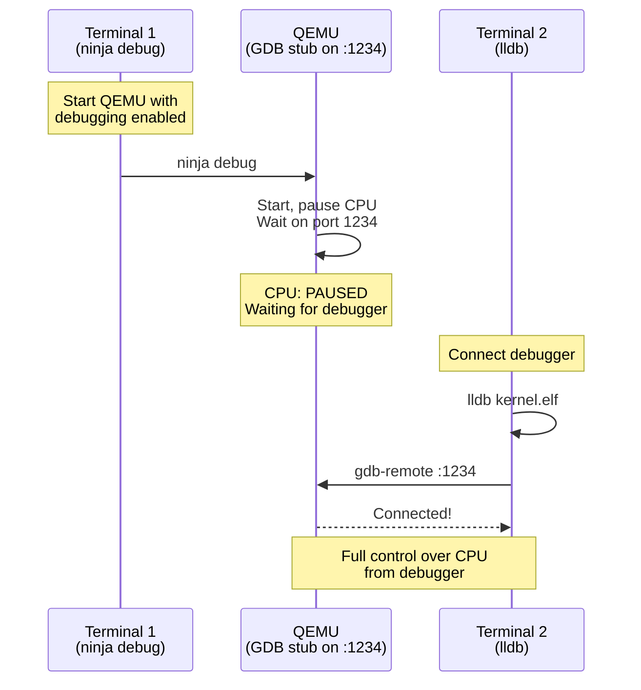

# Booting Up

We have a bootable ISO image containing our kernel and GRUB. Now it's time to actually boot it and prove everything works.

Time for the moment of truth. Boot the ISO in QEMU:

```bash
ninja -C build run
```

QEMU should open with and tell us it is booting JANUS. After that there will be no other visible output—just a black screen.

QEMU should open and begin booting JANUS. After that there will be no other visible output—just a black screen.

**Don't panic. This is success.**

I know, I know—a black screen doesn't *feel* like success. But think about what should now have happened behind that void:

1. GRUB boots and scans the first 32KB of your kernel
2. Finds the Multiboot2 magic number (0xe85250d6)
3. Validates the checksum
4. Loads your kernel at 1MB (0x100000) in 32-bit protected mode
5. Jumps to `_start` in your boot assembly
6. Your boot assembly sets up page tables and transitions to 64-bit long mode
7. Your assembly sets up a stack and calls `kernel_main()`
8. `kernel_main()` checks the Multiboot magic (0x36d76289)
9. Enters the infinite `hlt` loop

The black screen is expected. We haven't written any code to output text yet. No VGA driver, no serial console—nothing. The kernel is sitting in that `while(1) __asm__("hlt")` loop exactly as designed, waiting patiently for instructions we haven't given it yet.

Press Ctrl+C to exit QEMU. But how do we know it's actually working?
Let's use LLDB to prove the kernel is actually running our code.

[!side]
The GDB stub supports the GDB Remote Serial Protocol and can therefore be used with GDB as well as LLDB. If you are more familiar with GDB, feel free to use it instead of LLDB for this section.
[/!side]

LLDB is a debugger (like GDB) that lets you pause a running program, inspect memory and registers, and step through code line by line. QEMU has a "GDB stub" that lets debuggers connect to the virtual machine and control the CPU.

> **New to LLDB?**
>
> Yes, it's a command-line debugger. If you've used a debugger in an IDE you already know the concepts—breakpoints, stepping, inspecting variables.
> LLDB just does it via text instead of clicking some buttons. Think of it as your GUI debugger's grumpy but efficient terminal-dwelling relative.
>
> Another key difference also comes from using QEMU: we need to debug *remotely* over a network connection to QEMU's virtual CPU.
>
> When debugging a kernel, register values become important. Variables exist, but at this level you'll spend a lot of time looking at registers directly rather than at named variables—especially when you're stepping through assembly.
>
> **Essential commands (the cheat sheet):**
>
> | Command | What it does |
> |---------|-------------|
> | `gdb-remote localhost:1234` | Connect to QEMU's debugger |
> | `b kernel_main` | Set breakpoint at entry point of the function kernel_main |
> | `b main.c:42` | Set breakpoint at line 42 in main |
> | `c` | Continue execution until breakpoint |
> | `n` | Next line (step over function calls) |
> | `stepi` | Execute single assembly instruction |
> | `step` | Next line (step into function calls) |
> | `frame variable` | Print the values of local variables and parameters in the current stack frame |
> | `p/x variable` | Print in hexadecimal |
> | `p/x $rdi` | Print register RDI in hex |
> | `register read` | Show all CPU registers |
> | `bt` | Show backtrace (call stack) |
> | `q` | Quit LLDB |

### The Debugging Setup



## The Moment of Truth

Let's boot our kernel:

```bash
ninja -C build run
```

**What you might see:** The QEMU window opens showing "Booting from DVD/CD..." and then appears to hang. Nothing visible happens. No crash, no obvious error. It *looks* like it's working, but is it?

This is deceptive! The kernel might actually be stuck in an infinite loop or triple faulting silently. Let's debug properly to see what's really happening.

## Debugging with LLDB

Let's use LLDB to see exactly what the CPU is doing. Start QEMU in debug mode:

```bash
ninja -C build debug
```

This starts QEMU waiting for a debugger connection. In another terminal, connect with LLDB:

```bash
lldb build/kernel.elf
```

### Connecting to QEMU

At the `(lldb)` prompt, connect to QEMU's debugging port:

```
(lldb) gdb-remote localhost:1234
```

**What just happened?** LLDB connected to QEMU's GDB stub. The CPU is currently sitting at the BIOS reset vector (address 0xFFF0), about to start executing boot code.

Open the debugger, then instruct LLDB to connect to QEMU's debugging port.
Next we tell LLDB to pause when we enter `kernel_main`:

```
(lldb) b kernel_main
```

[!side]
In most debuggers breakpoints work by replacing the instruction at that address with a special instruction (INT 0x03 on x86) that traps to the debugger.
[/!side]

Now let the kernel boot:

```
(lldb) c
Process 1 resuming
Process 1 stopped
* thread #1, stop reason = breakpoint 1.1
    frame #0: 0x000000000010109f kernel.elf`kernel_main(magic=920085129, info=0x00000000001010e0) at main.c:42:15
   39   void kernel_main(uint32_t magic, struct multiboot_info * info)
   40   {
-> 41       if (magic != MULTIBOOT2_BOOTLOADER_MAGIC) {
```

Let's verify GRUB passed us the correct magic number. The `$rdi` register holds the first function argument (the `magic` parameter):

```
(lldb) p/x magic
(uint64_t) $0 = 0x0000000036d76289
```

Let's check the multiboot info pointer in `info` (second argument):

```
(lldb) p/x info
(uint64_t) $1 = 0x00000000001010e0
```

That's a valid address pointing to the Multiboot information structure GRUB created for us.
Currently we cannot check the contents of that structure since we haven't defined its layout at this point in time.

Let's watch the magic number check execute:

```
(lldb) n
Process 1 stopped
* thread #1, stop reason = step over
    frame #0: 0x00000000001010a9 kernel.elf`kernel_main(magic=920085129, info=0x00000000001010e0) at main.c:51:15
   48       }
   49   
   50       // Verify multiboot info pointer is valid
-> 51       if (info == NULL) {
```

**What happened?** `n` means "next" (step to the next line). Since the value was correct the magic check passed, so execution moved to line 51.

After the null check has passed we

```
(lldb) n
Process 1 stopped
* thread #1, stop reason = step over
    frame #0: 0x00000000001010b9 kernel.elf`kernel_main(magic=920085129, info=0x00000000001010e0) at main.c:61:12
   58       
   59   
-> 60       for (;;) {
```

The null check passed too! Now we're at the infinite loop where the kernel halts.

In order to check all the registers and get a more detailed view of the CPU state, we can use the `register read` command:

```
(lldb) register read
general:
       rax = 0x0000000080000000
       rbx = 0x00000000001010c0
       rcx = 0x00000000c0000080
       rdx = 0x0000000000000000
       rsi = 0x00000000001010c0
       rdi = 0x0000000036d76289
       rbp = 0x0000000000106ff0 kernel.elf`stack_bottom + 16368  kernel.elf`stack_bottom + 16368
       rsp = 0x0000000000106fe0 kernel.elf`stack_bottom + 16352  kernel.elf`stack_bottom + 16352
        r8 = 0x0000000000000000
        r9 = 0x0000000000000000
       r10 = 0x0000000000000000
       r11 = 0x0000000000000000
       r12 = 0x0000000000000000
       r13 = 0x0000000000000000
       r14 = 0x0000000000000000
       r15 = 0x0000000000000000
       rip = 0x000000000010109f kernel.elf`kernel_main + 15 at main.c:42:15  kernel.elf`kernel_main + 15 at main.c:42:15
```

You can see that `rsp` points to our stack and that `rdi` and `rsi` hold the function arguments.

Using LLDB, we now have verified that GRUB loaded and jumped to our kernel, our boot assembly executed correctly, we transitioned to 64-bit mode, and our C code is running with the correct parameters.

The blank screen isn't a bug—it's exactly what we programmed it to do. Since we haven't written any video or serial output code yet, there's nothing to display. But under the hood, the kernel booted successfully and we verified the magic number and multiboot info pointer.

To exit LLDB, simply type:

```
(lldb) exit
```

> **Common Issues:**
>
> **The QEMU window is not visible**
>
> Using a minimal window manager like i3wm, QEMU might default to using VNC output.
> To make the window visible you can either use a VNC viewer or setup SDL or GTK and specify it as the display type that is used:
>
> ```bash
> qemu-system-x86_64 -cdrom ./build/janus_x86_64.iso -boot d -serial stdio -display sdl
> qemu-system-x86_64 -cdrom ./build/janus_x86_64.iso -boot d -serial stdio -display gtk
> ```
>
> **Debugger Won't Connect**
>
> If you see an error like `error: Failed to connect to localhost:1234` when trying to connect with LLDB make sure QEMU is running in debug mode:
>
> ```bash
> ninja -C build debug
> ```
>
> You should see "waiting for debugger on :1234" in the output.
>
> **Breakpoint cannot be set**
>
> If the breakpoint for kernel_main cannot be set and you get a warning like `WARNING:  Unable to resolve breakpoint to any actual locations.`,
> verify that the kernel has been built with debug symbols:
>
> ```bash
> file build/kernel.elf
> ```
>
> This should show that the file is not stripped and contains debug info.

---

**Next: [Boot Info verification](boot-info-verification.md)**
