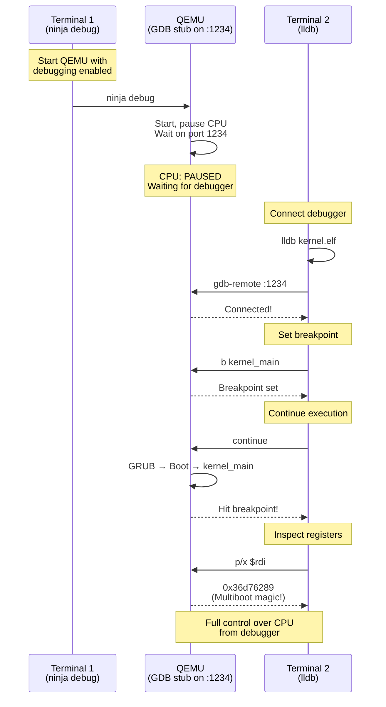

# Booting Up

We have a bootable ISO image containing our kernel and GRUB. Now it's time to actually boot it and prove everything works.

## Testing in QEMU

Time for the moment of truth. Boot the ISO:

```bash
ninja -C build run
```

QEMU should open with... a blank screen. Just black. Nothing.

**Don't panic. This is success.**

[!side]
Every OS developer's first kernel: a beautifully crafted black rectangle. Embrace it!
[/!side]

I know, I know—a black screen doesn't *feel* like success. But think about what's actually happening behind that void:

1. GRUB boots and scans the first 32KB of your kernel
2. Finds the Multiboot2 magic number (0xe85250d6)
3. Validates the checksum
4. Loads your kernel at 1MB (0x100000) in 32-bit protected mode
5. Jumps to `_start` in your boot assembly
6. Your boot assembly sets up page tables and transitions to 64-bit long mode
7. Your assembly sets up a stack and calls `kernel_main()`
8. `kernel_main()` checks the Multiboot magic (0x36d76289)
9. Enters the infinite `hlt` loop

**Your code is running on bare metal.** (Well, virtualized bare metal, but still!)

The black screen is expected. We haven't written any code to output text yet. No VGA driver, no serial console—nothing. The kernel is sitting in that `while(1) __asm__("hlt")` loop exactly as designed, waiting patiently for instructions we haven't given it yet.

Press Ctrl+C to exit QEMU. But how do we know it's actually working?

## Proving the Kernel Works with LLDB

A blank screen doesn't feel like success. Let's use LLDB to prove the kernel is actually running our code.

[!side]
The GDB stub speaks the GDB Remote Serial Protocol. LLDB understands this protocol too.
[/!side]

**What is LLDB?** LLDB is a debugger (like GDB) that lets you pause a running program, inspect memory and registers, and step through code line by line. QEMU has a "GDB stub" that lets debuggers connect to the virtual machine and control the CPU.

> **New to LLDB? Don't panic.**
>
> Yes, it's a command-line debugger. No, you don't need to memorize 47 arcane incantations. If you've used VS Code's debugger or CLion's, you already know the concepts—breakpoints, stepping, inspecting variables. LLDB just does it via text instead of clicking pretty buttons. Think of it as your GUI debugger's grumpy but efficient terminal-dwelling cousin.
>
> Another key difference also comes from using QEMU: we need to debug *remotely* over a network connection to QEMU's virtual CPU.
>
> **Kernel debugging quirks you need to know:**
>
> - **Registers are your best friends now.** Variables? Sure, they exist. But when debugging at this level, you'll spend more time looking at `$rdi` (first function argument) and `$rsi` (second argument) than at named variables. The x86-64 calling convention puts the first 6 arguments in RDI, RSI, RDX, RCX, R8, R9. Your kernel lives in these registers before it lives anywhere else.
> - **No printf debugging.** Seriously. You have no console output yet. Want to check if a value is 0x36d76289? Use `p/x variable` and squint at hex numbers like it's 1975. (We'll fix this eventually with serial output in chapter 4, but for now, embrace the old ways.)
> - **Your call stack is adorably tiny.** Run `bt` and you'll see exactly two frames: `kernel_main` ← `long_mode_start`. That's it. That's your entire kernel so far.
> - **Format specifiers are your friends:** `p/x` for hex (addresses, magic numbers), `p/t` for binary (flags, bitmasks), `p/d` for decimal (counts).
>
> **Essential commands (the cheat sheet):**
>
> | Command | What it does |
> |---------|-------------|
> | `gdb-remote localhost:1234` | Connect to QEMU's debugger |
> | `b kernel_main` | Set breakpoint at entry point of the function kernel_main |
> | `b main.c:42` | Set breakpoint at line 42 in main |
> | `c` | Continue execution until breakpoint |
> | `n` | Next line (step over function calls) |
> | `stepi` | Execute single assembly instruction |
> | `step` | Next line (step into function calls) |
> | `frame variable` | Print the values of local variables and parameters in the current stack frame |
> | `p/x variable` | Print in hexadecimal |
> | `p/x $rdi` | Print register RDI in hex |
> | `register read` | Show all CPU registers |
> | `bt` | Show backtrace (call stack) |
> | `q` | Quit LLDB |

### The Debugging Setup



## The Moment of Truth

Let's boot our kernel:

```bash
ninja -C build run
```

**What you might see:** The QEMU window opens showing "Booting from DVD/CD..." and then appears to hang. Nothing visible happens. No crash, no obvious error. It *looks* like it's working, but is it?

This is deceptive! The kernel might actually be stuck in an infinite loop or triple faulting silently. Let's debug properly to see what's really happening.

## Debugging with LLDB

Let's use LLDB to see exactly what the CPU is doing. Start QEMU in debug mode:

```bash
ninja -C build debug
```

This starts QEMU waiting for a debugger connection. In another terminal, connect with LLDB:

```bash
lldb build/kernel.elf
```

### Connecting to QEMU

At the `(lldb)` prompt, connect to QEMU's debugging port:

```
(lldb) gdb-remote localhost:1234
```

**What just happened?** LLDB connected to QEMU's GDB stub. The CPU is currently sitting at the BIOS reset vector (address 0xFFF0), about to start executing boot code.

IAfter connecting to QEMU we set a breakpoint at our entry point:

```
(lldb) b kernel_main
```

The debugger should hit the breakpoint at `kernel_main`. Now let's step through and watch what happens. Check the current instruction:

```
(lldb) c
```

You should see your kernel_main entry code. Now step through the code

```
(lldb) stepi
(lldb) stepi
... (step through to the 'call kernel_main' instruction)
```

**What really happens:** When you step into `call kernel_main`, check the CPU mode:

```
(lldb) exit
```

## Common Issues

### Black Screen Forever

**Symptom:** QEMU shows black screen and hangs

**This is normal!** Your kernel is working correctly. It's sitting in the `hlt` loop. Press Ctrl+C to exit.

### Debugger Won't Connect

**Symptom:** `gdb-remote localhost:1234` hangs or fails

**Solution:** Make sure QEMU is running with the `debug` target:

```bash
ninja -C build debug
```

You should see "waiting for debugger on :1234" in the output.

### Breakpoint Not Hit

**Symptom:** Breakpoint set but never triggered

**Solution:** Verify the kernel has debug symbols:

```bash
file build/kernel.elf
# Should show "with debug_info, not stripped"
```

## Quick Reference

```bash
ninja -C build         # Build kernel only
ninja -C build iso     # Build kernel and create ISO
ninja -C build run     # Build, create ISO, and boot in QEMU
ninja -C build debug   # Build, create ISO, and boot with debugger
```

## What We've Accomplished

At this point, you have:

- A bootable kernel that loads via GRUB
- Ability to test changes immediately with `ninja -C build run`
- Debugging setup with LLDB to verify kernel behavior

The kernel doesn't produce any output yet, but it boots and runs correctly. That's a major milestone!

---

**Next: [Boot Info verification](boot-info-verification.md)**
