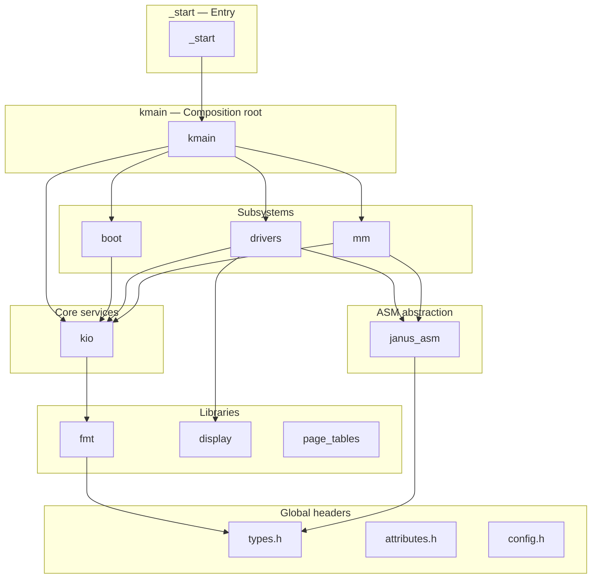

# JANUS — Overview

JANUS is a freestanding kernel written in C17, targeting x86_64 and aarch64.

## Design Principles

### Strict Layering

JANUS is organised into layers with one-directional dependencies. No module may
depend on anything in the same layer or above it; violations are caught at CMake
configure time. This discipline keeps each layer independently comprehensible and
eliminates entire classes of coupling bugs before they can reach the linker.

### Modular, Co-located Architecture

Each module has clear boundaries, explicit dependencies, and a public header
interface that is the sole point of contact with the rest of the kernel. Rather
than centralising all platform code in a single `arch/` tree, every subsystem and
library contains its own `arch/` subdirectory. This means a module's complete
implementation — generic logic and platform-specific code alike — is navigable as
a single unit without jumping between distant directories.

### Public Structures Over Opaque Handles

Kernel data structures are defined publicly rather than hidden behind opaque
pointer typedefs. In a freestanding environment, the canonical justification for
opaque handles — binary API stability across shared-library boundaries — simply
does not exist, while the costs are immediate and tangible: pointer indirection,
mandatory heap allocation, degraded cache locality, and structures that appear as
featureless `void *` values in a debugger. Public structures admit stack allocation,
in-place embedding for cache-friendly layouts, and complete visibility in LLDB or
GDB. Opaque handles are reserved for the narrow set of genuine abstraction
boundaries where the underlying representation varies at runtime, such as
framebuffer backends.

## Language and Assembly

All kernel code is written in C17 (`-std=gnu17`). C17 was chosen because it is
the most recent revision of the language standard with universal compiler support,
and it provides `_Static_assert`, `_Alignof`, and `_Noreturn` — facilities that
a freestanding kernel benefits from directly.

x86_64 assembly is written in NASM using Intel syntax. aarch64 assembly uses GAS
with standard ARM syntax. Inline `asm` is used sparingly and only for
single-instruction helpers, such as `hlt` or memory barriers, where a standalone
assembly file would add more indirection than clarity.

## Compiler Support

Both GCC and Clang are supported and tested in CI across the full
architecture matrix:

| Preset | Compiler | Architecture |
|---|---|---|
| `x86_64-gcc` | GCC | x86_64 |
| `x86_64-clang` | Clang | x86_64 |
| `aarch64-gcc` | GCC | aarch64 |
| `aarch64-clang` | Clang | aarch64 |

All configurations compile with `-Wall -Wextra -Werror -Wconversion` combined with
the freestanding flags `-ffreestanding -fno-builtin -nostdlib`.
