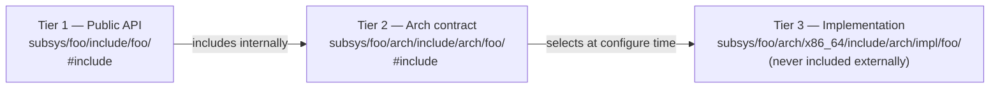

# Architecture

## Layer Model

The entire kernel source tree is partitioned into layers ordered by abstraction level.
The single governing rule is that dependencies may only point downward:
a module may depend on anything in a lower layer, but never on a peer in the same
layer or on anything above it.
CMake enforces this constraint through its target dependency graph.
A violation causes a configure-time fatal error before any compiler is invoked.

|Location                   | Name          | Description                                                           |
|---------------------------|---------------|-----------------------------------------------------------------------|
| kernel/_start/            | Entry         | assembly entry point, linker script, creates kernel.elf               |
| kernel/kmain/             | Composition   | the only module permitted to depend on subsystems                     |
| kernel/subsys/            | Subsystems    | mutually isolated                                                     |
| kernel/core/              | Core services | may use libraries, must not use subsystems                            |
| kernel/lib/               | Libraries     | no inter-library dependencies                                         |
| kernel/asm/               | ASM layer     | janus_asm INTERFACE; sole owner of raw assembly instruction wrappers  |
| kernel/include/           | Global        | types.h, attributes.h, config.h                                       |
| kernel/subsys/contracts/  | Contracts     | shared type definitions crossing subsystem boundaries                 |

### Key Invariants

**`_start`** links `kmain` and all subsystem libraries into the final `kernel-<boot protocol>.elf` executable.
It owns the architecture-specific entry point in assembly, the boot protocol header, and the linker script that defines the memory layout.

**`kmain`** is the composition root, the sole subsystem that may depend on other subsystems.
All inter-subsystem data flow is mediated through `kmain`, which acts as an explicit wiring point rather than allowing subsystems to reach one another directly.

**Subsystems** are strictly isolated from one another. `boot` cannot call into `drivers`, and `drivers` cannot call into `mm`.
When two subsystems need to exchange data, the information travels through `kmain` via an explicit parameter,
typically defined by a shared type that is defined in the contract layer.

**Core services** occupy the layer between libraries and subsystems.
A core module may depend on libraries but must not depend on subsystems.
This keeps cross-cutting services reusable from any subsystem.

**Libraries** are utility modules which act as the most basic building blocks for the kernel.
No library may depend on another library; each one is self-contained.

**The ASM layer** is the only layer permitted to contain raw instruction wrappers.
All higher layers call into `janus_asm` rather than embedding inline assembly directly.

**Contracts** Used for sharing types across a subsystem boundary.
Every artifact in the contract layer explicitly states its consuming subsystems, which is enforced using cmake.

## Directory Layout

```
kernel/
├── include/                Global headers: janus/types.h, attributes.h, config.h
├── contracts/              Cross-subsystem type contracts (allowlist-enforced)
├── _start/                 Entry layer — architecture and protocol subdirectories
├── kmain/                  Composition root — kernel_main(), init sequence
├── lib/                    Utility libraries
├── core/                   Cross-cutting services
└── subsys/                 Independent subsystems
    ├── boot/               Boot protocol parsing and context population
    ├── drivers/            Device drivers
    ├── interrupts/         Interrupt handling
    └── mm/                 Memory management
```

Architecture-specific code is co-located with the module that needs it rather than being aggregated in a centralised `arch/` tree.
A subsystem's complete implementation in particular both the platform-agnostic logic and the per-architecture code, is therefor navigable as a single unit.

## File Name Uniqueness

Every source file and header name must be **unique across the entire kernel tree**, with two permitted exceptions.
Duplicate names at different paths create ambiguity in tooling output (compiler diagnostics, linker errors, file-finder results) and force every reader to verify which copy is meant each time the name appears.

**Permitted exceptions:**

1. **Arch layer**: architecture-specific files intentionally carry the same base name because they provide alternative implementations of the same interface. For example, `console.c` exists in both `arch/x86_64/` and `arch/aarch64/`, and `mmu.c` exists under each architecture. Path-qualified `@file` tags and include-guard names (which embed the architecture name) disambiguate these unambiguously.

2. **Conditional compilation units**: the boot subsystem compiles exactly one of several protocol implementations per build (e.g. `limine_boot.c`, `multiboot2_boot.c`). Because they are alternatives rather than co-resident files, no collision occurs in practice — and their base names already differ to make the protocol scope explicit.

Outside these two cases, any new file whose base name already exists elsewhere in the tree must be renamed before it is merged.

## Three-Tier Include Hierarchy

Every module with architecture-specific code exposes its headers through three tiers, each with a distinct role:



**Tier 1** defines a stable public interface that other modules may include.
It is architecture-agnostic and internally includes the Tier 2 header.

**Tier 2** is the architecture contract.
It declares the `arch_*` functions that generic code calls, and includes the appropriate Tier 3 header for the current target architecture.

**Tier 3** is the implementation detail.
It contains the architecture-specific functions or macro definitions and is never included from outside the module.

## Dependency Graph

A Mermaid dependency diagram is generated automatically during each CMake configure run and written to `docs/generated/`. Contract edges are rendered with dashed arrows to distinguish type-sharing relationships from module dependencies.

See:

- [deps-x86_64.md](generated/deps-x86_64.md)
- [deps-aarch64.md](generated/deps-aarch64.md)
