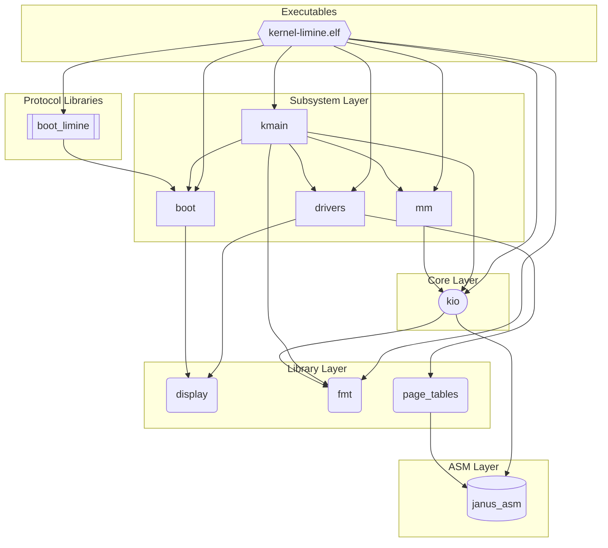

> *Generated for `aarch64` — run `cmake --preset <aarch64-preset>` to regenerate.*

```mermaid
graph TD
  subgraph lib_layer["Library Layer"]
    display("display")
    fmt("fmt")
    page_tables("page_tables")
  end
  subgraph core_layer["Core Layer"]
    kio(["kio"])
  end
  subgraph subsys_layer["Subsystem Layer"]
    boot["boot"]
    drivers["drivers"]
    mm["mm"]
    kmain["kmain"]
  end
  subgraph proto_layer["Protocol Libraries"]
    boot_limine[["boot_limine"]]
  end
  subgraph exec_layer["Executables"]
    kernel_limine_elf{{"kernel-limine.elf"}}
  end
  subgraph asm_layer["ASM Layer"]
    janus_asm[("janus_asm")]
  end
  page_tables --> janus_asm
  kio --> fmt
  kio --> janus_asm
  boot --> display
  boot_limine --> boot
  drivers --> display
  drivers --> page_tables
  mm --> kio
  kmain --> drivers
  kmain --> boot
  kmain --> fmt
  kmain --> kio
  kmain --> mm
  kernel_limine_elf --> drivers
  kernel_limine_elf --> boot
  kernel_limine_elf --> fmt
  kernel_limine_elf --> boot_limine
  kernel_limine_elf --> kio
  kernel_limine_elf --> mm
  kernel_limine_elf --> kmain
```
