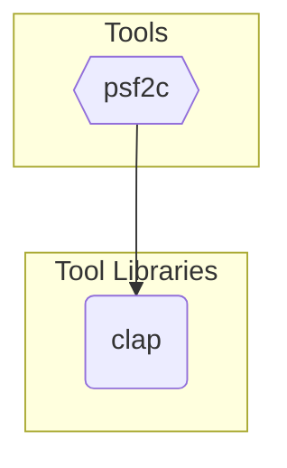

> *Generated at configure time — re-run `cmake -B build-tools` to regenerate.*

```mermaid
graph TD
  subgraph lib_layer["Tool Libraries"]
    clap("clap")
  end
  subgraph tool_layer["Tools"]
    psf2c{{"psf2c"}}
  end
  psf2c --> clap
```
