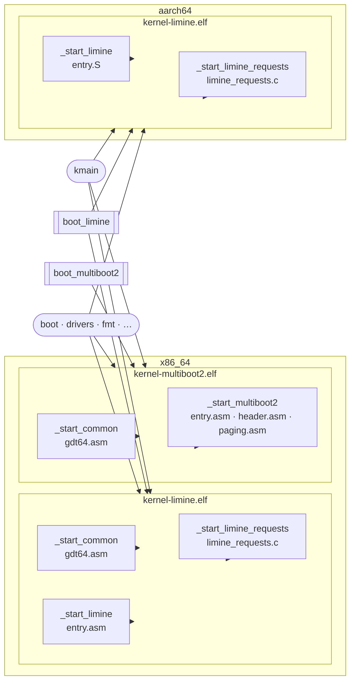

# Dependency Graph

This page visualises the relationships between all registered targets.
Separate diagrams are provided for the kernel and for the tools:

- **Kernel** — all subsystems, libraries, protocol libraries, and executables
- **Tools** — all tool libraries and tool executables

---

## Kernel Targets

Two views are provided for the kernel:

- **Module dependencies** — which targets depend on which other targets (generated from CMake at configure time)
- **Build artifacts** — which object files and protocol libraries are combined into each executable

## Module Dependencies

{{#include ../../generated/deps.md}}

> Node shapes: rounded rectangle = library · rectangle = subsystem · double rectangle = protocol library · hexagon = executable

## Build Artifacts

The kernel is linked into separate ELF binaries, one per boot protocol.
Assembly and C object files are combined with the subsystem libraries by the linker.

---

## Tool Targets

{{#include ../../generated/deps-tools.md}}

> Node shapes: rounded rectangle = tool library · hexagon = tool executable
