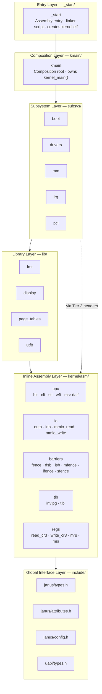

# Privilege Model & Revised Architecture

This document proposes a revised layered architecture for JANUS that formalises
the concept of privilege into the kernel's structural design. It is motivated by
three converging needs:

1. **Inline assembly is scattered** across Tier 3 headers in subsystems — it
   works, but there is no canonical home for "code that directly touches
   hardware state" as a concept.
2. **A microkernel migration path** should be structurally possible without
   having to fully re-design dependency relationships.
3. **The existing layer model** (inspired by Dijkstra's THE OS) already enforces
   downward-only dependencies but does not encode *why* each layer sits where it
   does — its justification is organisational rather than privilege-based.

---

## Reference Points

### Dijkstra's THE OS (1968)

THE was a 6-layer system where each layer could only call layers below it:

| Layer | Responsibility |
|---|---|
| 5 | User programs |
| 4 | User I/O buffering |
| 3 | Operator console |
| 2 | Memory management |
| 1 | CPU scheduling |
| 0 | Hardware |

JANUS already mirrors this philosophy: `_start` → `kmain` → `subsys` → `lib` →
`include`. The insight THE gives us is that layer position should be determined
by *what the layer can see*, not just by *what it needs*.

### CPU Privilege Rings

Modern CPU architectures implement multiple privilege levels:

| Ring | x86_64 | AArch64 | Typical use |
|---|---|---|---|
| −3 | Intel SMM | n/a | System Management Mode (firmware) |
| −2 | Intel ME / AMD PSP | n/a | Management Engine (out of scope) |
| −1 | VMX root / non-root | EL2 (hypervisor) | Hypervisor layer |
| 0 | Ring 0 | EL1 | Kernel |
| 1–2 | Rings 1–2 | (unused on AArch64) | Historically: OS services; now unused |
| 3 | Ring 3 | EL0 | User space |

JANUS currently runs entirely at Ring 0 / EL1. Rings −1 and −2 are the domain
of firmware and are permanently out of scope. Rings 1–2 are vestigial on modern
OSes. Ring 3 / EL0 is the future target for user-space processes once a
scheduler and syscall layer exist.

The key insight: within Ring 0, *software* can still enforce a privilege
hierarchy even though the hardware does not. This is exactly what the layer
model already does — but we can make it more explicit.

### LLVM's Inspiration

LLVM's most transferable idea is not the IR itself but the **tiered interface
pattern**: a stable public API sits above a thin bridge layer, which delegates
to architecture-specific implementations. JANUS already has this as the three-
tier include hierarchy (Tier 1 / 2 / 3). The lesson is to apply this pattern
*consistently* to every new layer, not just to subsystems.

### Linux

Linux separates `arch/` (all hardware-specific code) from `kernel/` (portable
subsystems), and within `arch/` separates machine-generic ARM code
(`arch/arm64/kernel/`) from SoC or board specifics (`arch/arm64/mach-*/`).
The takeaway for JANUS: the ISA boundary and the platform boundary are
*different* concerns and should live at different levels. Crucially, Linux's
`arch/` directory name already means something specific in JANUS — every
subsystem and library uses an `arch/` subdirectory for its architecture-specific
code. The asm layer therefore lives at `kernel/asm/`, keeping the two concepts
distinct by name.

---

## The Proposed Architecture

### New Layer: Inline Assembly Layer (asm)

The single concrete change is to extract all inline assembly and privileged
hardware access instructions from their current home (Tier 3 headers scattered
inside subsystem `arch/` trees) into a dedicated **inline assembly layer**
that lives at `kernel/asm/` and sits between the global interface layer
and the library layer.

This layer:

- Contains *only* header-only primitives.
- Never has `.c` files of its own.
- Has no link-time dependencies on any other layer.
- Is the **only** layer permitted to contain `__asm__ volatile`.
- Is consumed by Tier 3 headers inside subsystems, and by library code —
  **never directly by `kmain` or `_start`**.

The last point is deliberate. `kmain` is the composition root: it orchestrates
subsystems by calling their public APIs. It does not need to — and must not —
reach past that boundary to touch hardware primitives directly. If `kmain` were
to use asm layer headers, it would couple the composition logic to a specific CPU
architecture and undermine the whole purpose of the subsystem public API.

Conceptually the asm layer is "Ring 0 primitives" — the lowest software layer above
bare hardware that C code in the kernel may call, accessible only from the two
layers immediately above it: libraries and subsystem arch implementations.

---

### Revised Layer Stack



The dashed arrow reflects that subsystem Tier 3 headers consume asm layer primitives
*directly* — bypassing the library layer — because Tier 3 headers are part of
a subsystem's own arch implementation, not of the library layer. Libraries may
also use asm layer primitives directly (`page_tables` needs TLB maintenance;
`utf8` does not).

`kmain` and `_start` have **no arrow to the asm layer**. `kmain` may only call subsystem
public APIs (Tier 1 headers). `_start` sets up the stack in assembly before
handing off to `kmain`; its assembly is not inline C assembly and is not
subject to the asm layer rule.

---

### Where Each Existing File Moves

| Current location | New location | Notes |
|---|---|---|
| `subsys/drivers/arch/x86_64/include/arch/impl/drivers/cpu.h` (hlt, cli, sti) | `asm/x86_64/cpu.h` | Consumed by subsystem Tier 3 headers via `#include <asm/cpu.h>` |
| `subsys/drivers/arch/x86_64/include/arch/impl/drivers/io.h` (outb, inb) | `asm/x86_64/io.h` | Same pattern |
| `subsys/drivers/arch/aarch64/include/arch/impl/drivers/cpu.h` (wfi, msr daif) | `asm/aarch64/cpu.h` | Same pattern |
| New: memory barriers | `asm/x86_64/barriers.h` / `asm/aarch64/barriers.h` | Needed before IRQ, PCI, and HDA work |
| `lib/page_tables/arch/aarch64/mmu.c` (tlbi vale1is) | `asm/aarch64/tlb.h` | `asm_tlbi_vale1is`, `asm_tlbi_vmalle1is` — needed by `mm` / `page_tables` |
| `lib/page_tables/arch/aarch64/mmu.c` (mrs ttbr1_el1) | `asm/aarch64/regs.h` | `asm_read_ttbr1_el1`, `asm_write_ttbr1_el1`, `asm_read/write_ttbr0_el1` — needed by `mm` and `irq` |

The actual Tier 3 header files in subsystems do *not* need to move. They become
thin forwarding headers that `#include` the corresponding asm layer primitive and
re-export the subsystem-namespaced function:

```c
// subsys/drivers/arch/x86_64/include/arch/impl/drivers/cpu.h
// (existing file — becomes a thin wrapper)

#include <asm/cpu.h>   // ← asm layer primitive

static __always_inline void arch_cpu_halt(void)               { asm_cpu_hlt(); }
static __always_inline void arch_cpu_disable_interrupts(void) { asm_cpu_cli(); }
static __always_inline void arch_cpu_enable_interrupts(void)  { asm_cpu_sti(); }
```

This preserves the existing three-tier include chain for all consumers of
`<drivers/cpu.h>` while giving the asm layer primitives a canonical home.

> **Rule**: Subsystems and libraries are free to use asm layer headers via their
> Tier 3 wrappers or directly (for library code). `kmain` may not. If `kmain`
> needs a hardware operation, it calls a subsystem API. If no subsystem API
> covers the operation yet, the correct fix is to extend a subsystem — not to
> reach into the asm layer.

---

### The Privilege Model Stated Explicitly

| Layer | Privilege level | What it may do | May use asm layer directly? |
|---|---|---|---|
| Global Interface | n/a (data types only) | Define integer widths, compiler hints, build config | No |
| asm layer | Ring 0 hardware access | Emit privileged instructions via `__asm__ volatile`; no state | Is the source |
| Libraries | Ring 0 algorithms | Call asm layer primitives; manipulate data structures; no subsystem deps | Yes |
| Subsystems | Ring 0 services | Own hardware state; expose initialised APIs to `kmain`; call libs and asm layer via Tier 3 | Yes (via Tier 3) |
| Composition (`kmain`) | Ring 0 orchestration | Call subsystem public APIs only; never bypass the subsystem boundary | **No** |
| Entry (`_start`) | Ring 0 → Ring 0 | Set up stack in standalone assembly; call `kernel_main` | **No** (assembly files, not inline C) |

Everything currently in the kernel lives at Ring 0 / EL1 and will continue to
do so. The model above is a *software* privilege hierarchy derived from
dependency ordering, not a hardware privilege distinction.

