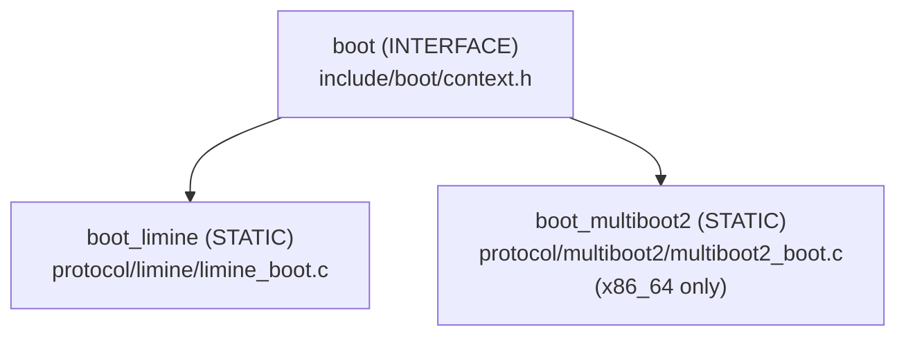

# subsys

Kernel subsystems own hardware state and expose public C APIs.
Each subsystem is isolated, meaning each subsystems may not depend on other subsystems.
Only `kmain` is permitted to depend on other subsystems.

Architecture-specific code lives inside the owning subsystem under `arch/`, following the three-tier include hierarchy (Tier 1 public → Tier 2 contract → Tier 3 implementation).

## Subsystems

### boot

The boot subsystem bridges the gap between firmware-provided boot data and the kernel's internal representation.
Its responsibility ends the moment `boot_init` returns a populated `boot_context_t`; everything above that boundary treats the
boot context as an immutable record of what the firmware reported.

The subsystem itself compiles no code, it is an INTERFACE library that only exports it's headers.
The actual initialisation logic lives in protocol-specific static libraries that are built and linked independently:

At link time, exactly one protocol library is selected.
The linker resolves the `boot_init` symbol to whichever protocol was compiled in.
This means the boot protocol is a link-time decision with zero runtime overhead and no conditionals in the common kernel path, similar to how different CPU architectures are handled.

Every `boot_init` implementation populates all fields of `boot_context_t` unconditionally before returning, which prevents uninitialized-read bugs in the subsystems that consume the context.

| Protocol   | Architectures   | Entry mechanism                                                   |
|------------|-----------------|-------------------------------------------------------------------|
| Limine     | x86_64, aarch64 | Assembly entry calls `kernel_main` directly                       |
| Multiboot2 | x86_64          | Assembly stashes magic and info pointer, then calls `kernel_main` |

To add a new protocol:

* create a folder called `protocol/<name>/`, with a CMakeLists.txt that builds a static library linking `PUBLIC boot`
* implement `boot_init()` such that it sets every field unconditionally
* add the architecture-specific assembly entry points under `_start/<arch>/<name>/`
* register the protocol in `cmake/boot/`.

More information about the submodule can be found in its [Readme](boot/README.md)

### mm

The memory management subsystem currently consists of a single component.
A bitmap-based physical memory manager that covers up to 4 GiB of physical address space.
The bitmap is a 128 KiB static array allocated in `.bss`, where each bit represents one 4 KiB page frame.
A value of `1` means free; `0` means used.
The bitmap is zero-initialised by the linker, so all frames start as used by default.
Initialisation then marks usable regions free in two passes:

1. Walk the boot memory map and mark all `USABLE` and `BOOTLOADER_RECLAIMABLE`
   regions free.
2. Punch out the first 1 MiB unconditionally (reserved for BIOS, ISA DMA, and
   VGA) and the kernel image frames.

`mm_pmm_alloc_page()` returns physical address `0` when no free frame is available.
Since physical address `0` is permanently reserved and never a valid allocatable frame, this value serves as a sentinel that callers can check without a separate error path.

Virtual memory management and higher-level allocators are planned as future layers built on top of the physical memory manager implementation.

More information about the submodule can be found in its [Readme](mm/README.md)

## drivers

The drivers subsystem provides narrow, hardware-facing C APIs for devices that the kernel needs during early initialisation.
Each driver exposes its public interface through `include/drivers/` and hides all hardware register access behind the three-tier include hierarchy, so the generic driver code is fully portable and the architecture-specific code is contained in a single, auditable location.

| Driver | Description                                                    |
|--------|----------------------------------------------------------------|
| Serial | Character-level UART output — COM1 on x86_64, PL011 on aarch64 |
| TTY    | Text terminal rendering over VGA text mode or a framebuffer    |

The TTY generic layer owns cursor tracking, line wrapping, scrolling, and colour state.
Architecture-specific cell writing is delegated to `arch_tty_*` functions, which are resolved at link time to the platform's implementation.

To add a new driver, provide the public header in `include/drivers/`, add architecture-specific implementations under `arch/<arch>/`, and add any platform-agnostic source in `src/`.

More information about the submodule can be found in its [readme](drivers/README.md)

## interrupts

The interrupts subsystem installs CPU exception handling so that hardware faults become readable kernel panics over `kio` instead of silent triple-faults and machine resets.
Its single entry point, `interrupts_init`, must be called once after console initialisation and before any subsystem that can fault (e.g. the physical memory manager).

The public surface is intentionally architecture-agnostic: no x86_64 concept (IDT, CR2, gate type) appears above the arch contract boundary.

Currently interrupts are not implemented for aarch64.

More information about the subsystem can be found in its [README](interrupts/README.md)
