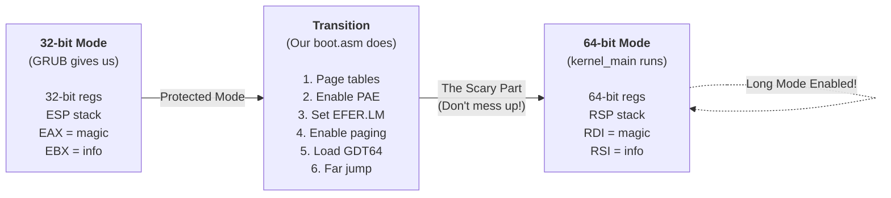

# Understanding the 64-bit Transition

In the previous section, we discovered that GRUB2 already puts us in 64-bit mode when loading a 64-bit kernel. But **how** does GRUB do that? And how do we write proper boot code that preserves multiboot parameters correctly?

This chapter answers both questions by implementing the complete boot sequence ourselves—including the mode transition that GRUB normally handles for us.

## Why Implement What GRUB Already Does?

Modern GRUB2 with Multiboot2 already transitions to 64-bit mode for us. So why learn how?

Because understanding the transition teaches you **fundamental OS concepts** you'll need later:

- **CPU operating modes** and their constraints  
- **Page table structure** and virtual memory setup
- **Control registers** (CR0, CR3, CR4) and MSRs
- **The relationship between paging and long mode**
- **GDT structure** and segment selectors

These concepts are essential for memory management (Chapter 5), context switching, and system calls. GRUB's convenience hides them, but you need to understand the machinery to build a real kernel.

Think of it like learning to drive a manual transmission—even if you'll mostly drive automatic cars, understanding how the clutch and gears work makes you a better driver.

Additionally if you would like to support Bootloaders that leave you in 32-bit mode (e.g., Multiboot1, legacy GRUB, or bare metal) you need to do this all manually.

## The Complete Boot Sequence

We'll implement what GRUB does behind the scenes. The transition requires:

[!side]
Unlike 32-bit mode, long mode *requires* paging to be enabled. No paging = no 64-bit mode.
[/!side]

1. **Save multiboot parameters** before they get clobbered  
2. **Set up page tables** for identity mapping
3. **Enable PAE** (Physical Address Extension)
4. **Set long mode bit** in EFER MSR
5. **Enable paging** to activate long mode
6. **Load 64-bit GDT** defining our code segment
7. **Jump to 64-bit code** with a far jump
8. **Restore parameters** and call kernel_main

[!side]
**Can we skip the 32-bit code?**

If you're using GRUB2 with Multiboot2 and a 64-bit kernel, yes! GRUB starts you directly in 64-bit mode at step 7. But we're implementing the full sequence to:

1. Understand how the CPU mode transition works
2. Support older bootloaders or bare metal scenarios  
3. Learn page table setup before Chapter 5
4. Properly preserve multiboot parameters

You can skip to Step 5 (64-bit entry) if you only care about modern GRUB2, but I recommend reading the full sequence for educational value.
[!side]

Let's implement each step.

## Building the Boot Assembly

We'll build `boot/boot.asm` incrementally, adding each piece as we explain it.

### Step 1: Declarations and BSS Section

Start with the global declarations and stack/page table reservations:

```asm-diff
file: boot/boot.asm
replace: entire file
---
+; Boot entry point - called by GRUB in 32-bit protected mode
+global _start
+extern kernel_main
+
+; Reserve stack space in BSS section
+section .bss
+align 16
+stack_bottom:
+    resb 16384              ; 16 KiB stack
+stack_top:
+
+; Page tables for long mode (must be page-aligned)
+align 4096
+p4_table:
+    resb 4096
+p3_table:
+    resb 4096
+p2_table:
+    resb 4096
```

We reserve space in the BSS (uninitialized data) section for our stack and page tables. The page tables must be 4096-byte (4KB) aligned because that's the page size the CPU expects.

### Step 2: 32-bit Entry Point

Add the entry point where GRUB transfers control to us:

```asm-diff
file: boot/boot.asm
after: resb 4096
---
 p2_table:
     resb 4096
+
+section .text
+bits 32                     ; GRUB puts us in 32-bit protected mode
+
+_start:
+    ; At this point:
+    ; - EAX = multiboot magic (0x36d76289)
+    ; - EBX = physical address of multiboot info structure
+    ; - CPU is in 32-bit protected mode
+    
+    ; Save multiboot info (we'll need them after switching to long mode)
+    mov edi, eax            ; Save magic
+    mov esi, ebx            ; Save multiboot info pointer
+    
+    ; Set up stack pointer
+    mov esp, stack_top
+    
+    ; Set up page tables and enable long mode
+    call setup_page_tables
+    call enable_paging
+    
+    ; Load 64-bit GDT
+    lgdt [gdt64.pointer]
+    
+    ; Jump to 64-bit code
+    jmp gdt64.code:long_mode_start
```

GRUB passes parameters in EAX (multiboot magic number) and EBX (pointer to multiboot info). We save them to EDI and ESI because these registers are preserved across the mode switch. In 64-bit mode, EDI becomes RDI and ESI becomes RSI—exactly where the System V AMD64 ABI expects the first two function arguments.

### Step 3: Page Table Setup Function

Now add the function that creates our page tables:

```asm-diff
file: boot/boot.asm
after: jmp gdt64.code:long_mode_start
---
     jmp gdt64.code:long_mode_start
+
+; Set up identity-mapped page tables
+; Maps first 2MB of physical memory
+setup_page_tables:
+    ; Map P4[0] -> P3
+    mov eax, p3_table
+    or eax, 0b11            ; Present + writable
+    mov [p4_table], eax
+    
+    ; Map P3[0] -> P2
+    mov eax, p2_table
+    or eax, 0b11            ; Present + writable
+    mov [p3_table], eax
+    
+    ; Map P2[0] -> 0MB (2MB huge page)
+    mov eax, 0x0
+    or eax, 0b10000011      ; Present + writable + huge page
+    mov [p2_table], eax
+    
+    ret
```

We create a simple identity mapping: virtual address 0x0 → physical address 0x0 for the first 2MB. The page entry flags are:

- Bit 0 (Present): Page is present in memory
- Bit 1 (Writable): Page can be written to
- Bit 7 (Huge page): This is a 2MB page, not a 4KB page

The flag value `0b11` equals \\(2^0 + 2^1 = 3\\) (present + writable), and `0b10000011` equals \\(2^0 + 2^1 + 2^7 = 131\\) (present + writable + huge page).

We're using a 2MB **huge page** which skips the P1 (page table) level entirely. This maps the entire first 2MB in one entry instead of 512 individual 4KB pages. A standard 4KB page would require \\(512\\) entries (since \\(2\\text{MB} = 2^{21}\\) bytes and \\(4\\text{KB} = 2^{12}\\) bytes, so \\(2^{21} / 2^{12} = 2^9 = 512\\) pages).

### Step 4: Enable Paging and Long Mode

Add the critical function that transitions the CPU to 64-bit mode:

```asm-diff
file: boot/boot.asm
after: setup_page_tables ret
---
     ret
+
+; Enable paging and enter long mode
+enable_paging:
+    ; Load P4 table address into CR3
+    mov eax, p4_table
+    mov cr3, eax
+    
+    ; Enable PAE (Physical Address Extension)
+    mov eax, cr4
+    or eax, 1 << 5          ; Set PAE bit
+    mov cr4, eax
+    
+    ; Enable long mode in EFER MSR
+    mov ecx, 0xC0000080     ; EFER MSR
+    rdmsr
+    or eax, 1 << 8          ; Set LM bit
+    wrmsr
+    
+    ; Enable paging
+    mov eax, cr0
+    or eax, 1 << 31         ; Set PG bit
+    mov cr0, eax
+    
+    ret
```

This function performs the mode transition sequence:

1. **CR3** ← P4 table address (tells CPU where page tables are)
2. **PAE** (Physical Address Extension) extends 32-bit addressing from 32 bits to 36 bits, allowing access to 64GB of physical memory (\\(2^{36}\\) bytes instead of \\(2^{32} = 4\\text{GB}\\)). PAE is required for 64-bit mode—you can't enable long mode without it.
3. **EFER.LM** (Extended Feature Enable Register, Long Mode bit) tells the CPU we want 64-bit mode. EFER is a Model-Specific Register (MSR) accessed with `rdmsr`/`wrmsr` instructions instead of normal register operations. You specify which MSR using ECX (0xC0000080 for EFER).
4. **CR0.PG** (Paging bit) activates paging. Once paging is enabled *and* LME is set in EFER, the CPU enters long mode!

### Step 5: 64-bit Entry Point

We're finally in long mode! Add the 64-bit entry point that calls our kernel:

```asm-diff
file: boot/boot.asm
after: enable_paging ret
---
     ret
+
+; 64-bit code starts here
+bits 64
+long_mode_start:
+    ; Clear segment registers
+    xor ax, ax
+    mov ss, ax
+    mov ds, ax
+    mov es, ax
+    mov fs, ax
+    mov gs, ax
+    
+    ; Call kernel main with preserved multiboot info
+    ; System V AMD64 ABI: first arg in RDI, second in RSI
+    ; (edi and esi were preserved from 32-bit mode)
+    call kernel_main
+    
+    ; If kernel_main returns, halt
+.hang:
+    cli
+    hlt
+    jmp .hang
```

In long mode, segment registers aren't used for addressing (flat memory model), but we zero them out for cleanliness. The EDI and ESI registers we saved in Step 2 are now RDI and RSI, perfectly positioned as the first two function arguments per the System V AMD64 calling convention.

### Step 6: Global Descriptor Table

Finally, add the GDT that defines our 64-bit code segment:

```asm-diff
file: boot/boot.asm
after: .hang loop
---
     jmp .hang
+
+; Global Descriptor Table for 64-bit mode
+section .rodata
+gdt64:
+    dq 0                                    ; Null descriptor
+.code: equ $ - gdt64
+    dq (1<<43) | (1<<44) | (1<<47) | (1<<53) ; Code segment
+.pointer:
+    dw $ - gdt64 - 1                        ; GDT size
+    dq gdt64                                ; GDT address
```

The GDT (Global Descriptor Table) defines memory segments. In 64-bit long mode, segmentation is mostly disabled (flat memory model), but we still need a GDT with at least a code segment to tell the CPU we're in 64-bit mode.

The code segment descriptor sets bits for: executable (bit 43), code/data segment (bit 44), present (bit 47), and 64-bit mode (bit 53). The value \\((1 << 43) | (1 << 44) | (1 << 47) | (1 << 53)\\) creates a 64-bit value with these specific bits set.

## Visualizing the Transition

### CPU Mode Transition Journey



> **TODO: Hand-drawn illustration idea**
> Draw the CPU as a character going through a transformation sequence like a video game power-up. Panel 1: "32-bit CPU" looking small and limited. Panel 2: runnung into a "PAE mushroom" and "EFER star". Panel 3: Powered up"

## Key Concepts

> **Aside: System V AMD64 ABI**
>
> ABI stands for Application Binary Interface—the rules for how functions are called at the assembly level. The System V AMD64 ABI (used by Linux, BSD, and most Unix-like systems) specifies:
>
> - **First 6 integer arguments** go in registers: RDI, RSI, RDX, RCX, R8, R9
> - **Return value** goes in RAX
> - **Stack must be 16-byte aligned** before a call instruction
> - **Certain registers are callee-saved** (RBX, RBP, R12-R15)
>
> So when we call `kernel_main(uint32_t magic, void *info)`, the magic number goes in RDI and the info pointer goes in RSI.

> **Aside: Page Table Naming**
>
> The names are confusing because Intel and AMD use different terminology:
>
> - **P4/PML4** = Page Map Level 4 (top level)
> - **P3/PDPT** = Page Directory Pointer Table
> - **P2/PD** = Page Directory
> - **P1/PT** = Page Table (we skip this by using huge pages)
>
> We use the shorter P4/P3/P2 names for simplicity.

## Testing the Fixed Boot Code

Now rebuild and test:

```bash
ninja -C build
ninja -C build run
```

**Result:** QEMU opens with a blank screen and doesn't crash! The kernel is running. Press Ctrl+C to exit.

We can verify it's working with LLDB (covered in the "Booting Up" chapter).

## What We've Accomplished

Our boot assembly now:

- Starts in 32-bit protected mode (as GRUB gives us)
- Sets up identity-mapped page tables for the first 2MB
- Enables PAE, long mode, and paging
- Loads a 64-bit GDT
- Transitions to 64-bit long mode
- Calls our 64-bit kernel successfully

No more triple faults!

In order to run from boot standards that do not guarantee that your CPU is in long mode use this alternative script.

```nasm
; Boot Entry Point
; TinyOS Boot Assembly Code
;
; Copyright (C) 2025 by Frederik Tobner
; This file is part of TinyOS.
; Licensed under the GNU Affero General Public License v3.0
; See https://www.gnu.org/licenses/agpl-3.0.en.html

; This code is executed immediately after the bootloader transfers control.
; It sets up 64-bit long mode and calls the C kernel entry point.
; For Bootloaders that leave you in 32-bit mode (e.g., Multiboot1, legacy GRUB, or bare metal)

global _start
extern kernel_main

; Reserve stack space in BSS section
section .bss
align 16
stack_bottom:
    resb 16384              ; 16 KiB stack
stack_top:

; Page tables for long mode (must be page-aligned)
align 4096
p4_table:
    resb 4096
p3_table:
    resb 4096
p2_table:
    resb 4096

section .text
bits 32                     ; Bootloader puts us in 32-bit protected mode

_start:
    ; At this point:
    ; - EAX contains the multiboot2 magic value (0x36d76289)
    ; - EBX contains the physical address of the multiboot information structure
    ; - CPU is in 32-bit protected mode
    
    ; Save multiboot info (we'll need them after switching to long mode)
    mov edi, eax            ; Save magic
    mov esi, ebx            ; Save multiboot info pointer
    
    ; Set up stack pointer
    mov esp, stack_top
    
    ; Set up page tables for long mode
    call setup_page_tables
    call enable_paging
    
    ; Load 64-bit GDT
    lgdt [gdt64.pointer]
    
    ; Jump to 64-bit code
    jmp gdt64.code:long_mode_start

; Set up identity-mapped page tables
; Maps first 2MB of physical memory
setup_page_tables:
    ; Map P4[0] -> P3
    mov eax, p3_table
    or eax, 0b11            ; Present + writable
    mov [p4_table], eax
    
    ; Map P3[0] -> P2
    mov eax, p2_table
    or eax, 0b11            ; Present + writable
    mov [p3_table], eax
    
    ; Map P2[0] -> 0MB (2MB huge page)
    mov eax, 0x0
    or eax, 0b10000011      ; Present + writable + huge page
    mov [p2_table], eax
    
    ret

; Enable paging and enter long mode
enable_paging:
    ; Load P4 table address into CR3
    mov eax, p4_table
    mov cr3, eax
    
    ; Enable PAE (Physical Address Extension)
    mov eax, cr4
    or eax, 1 << 5          ; Set PAE bit
    mov cr4, eax
    
    ; Enable long mode in EFER MSR
    mov ecx, 0xC0000080     ; EFER MSR
    rdmsr
    or eax, 1 << 8          ; Set LM bit
    wrmsr
    
    ; Enable paging
    mov eax, cr0
    or eax, 1 << 31         ; Set PG bit
    mov cr0, eax
    
    ret

; 64-bit code starts here
bits 64
long_mode_start:
    ; Clear segment registers
    xor ax, ax
    mov ss, ax
    mov ds, ax
    mov es, ax
    mov fs, ax
    mov gs, ax
    
    ; Call kernel main with preserved multiboot info
    ; System V AMD64 ABI: first arg in RDI, second in RSI
    ; (edi and esi were preserved from 32-bit mode)
    call kernel_main
    
    ; If kernel_main returns, halt
.hang:
    cli
    hlt
    jmp .hang

; Global Descriptor Table for 64-bit mode
section .rodata
gdt64:
    dq 0                                    ; Null descriptor
.code: equ $ - gdt64
    dq (1<<43) | (1<<44) | (1<<47) | (1<<53) ; Code segment
.pointer:
    dw $ - gdt64 - 1                        ; GDT size
    dq gdt64                                ; GDT address
```
